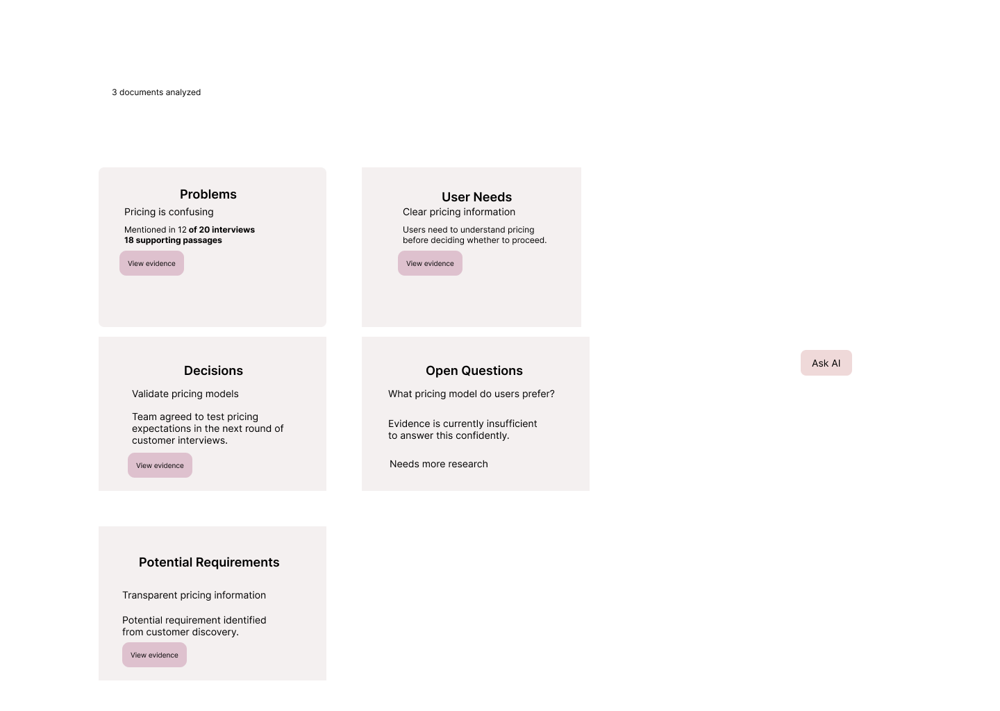
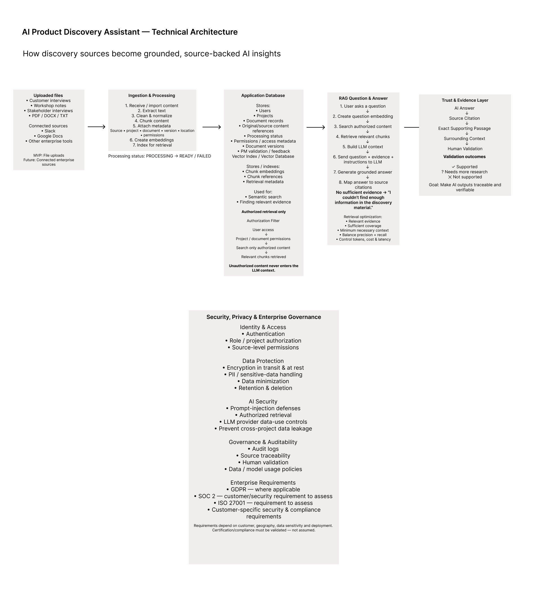

# AI Product Discovery Assistant

> A RAG-powered product concept that helps Product Managers turn unstructured customer discovery material into structured, source-backed product insights.

## The Problem

Product Managers collect valuable information across customer interviews, discovery workshops, stakeholder conversations, and research notes.

The challenge isn't simply collecting this information. It's turning large amounts of unstructured discovery material into useful product insights without losing important context or spending hours manually reviewing notes.

Existing AI summarization can reduce that effort, but for product decisions, a summary alone isn't enough. PMs need to understand:

- What problems are appearing repeatedly?
- What do users actually need?
- What decisions have been made?
- What questions remain unanswered?
- What potential requirements are emerging?
- What evidence supports each AI-generated insight?

This creates an additional trust problem: if AI generates an insight, the PM needs a quick way to verify that the conclusion is actually supported by the original research.

## Target User

**Primary user:** Product Manager / Product Owner / Business Analyst
## MVP Scope

The MVP focuses on a simple discovery workflow:

1. Upload discovery material such as customer interviews, workshop notes, or stakeholder interviews.
2. Process and organize the material using AI.
3. Surface structured insights across:
   - Problems
   - User Needs
   - Decisions
   - Open Questions
   - Potential Requirements
4. Ask natural-language questions across the discovery material.
5. Generate answers grounded in retrieved source evidence.
6. Show citations and the exact supporting passage so the PM can verify the AI's interpretation.
7. Allow the PM to validate an insight as:
   - Supported
   - Needs more research
   - Not supported

### Deliberately Out of Scope for the MVP

The first version does not include:

- Slack or Google Docs integrations
- Autonomous agents
- Figma integration
- Automated engineering or sprint tracking
- Large enterprise workflow integrations

These are potential future capabilities. The MVP first tests whether AI-assisted organization, retrieval, and source-backed insights provide meaningful value to Product Managers.

## Key Product Decisions

### 1. AI suggests; the PM decides

The product surfaces **Potential Requirements** rather than treating AI-generated suggestions as confirmed requirements.

This keeps the Product Manager responsible for interpreting evidence, considering business context, and making product decisions.

### 2. Evidence is part of the product experience

AI-generated insights include source citations and access to the exact supporting passage with surrounding context.

The goal is not only to generate an answer, but to make that answer traceable and verifiable.

### 3. Insufficient evidence is a valid answer

When the available discovery material does not support a conclusion, the product should say that there is insufficient evidence rather than generating a plausible-sounding answer.

For example:

> "I couldn't find enough information in the discovery material to determine which pricing model customers prefer."

### 4. Human validation creates a feedback signal

PMs can mark AI insights as **Supported**, **Needs more research**, or **Not supported**.

This feedback could later be used for evaluation and system improvement, but it should not be assumed to automatically retrain or correct the AI model.
The initial use case focuses on PMs working with customer interviews, workshop notes, stakeholder interviews, and other discovery material.

## Product Hypothesis
If Product Managers have one place to collect unstructured discovery information and AI can organize and retrieve relevant information with traceable source evidence, they can spend less time processing research while maintaining confidence in the insights used for product decisions.

## Interactive Prototype

A clickable prototype was created to explore the end-to-end product experience from uploading discovery material through AI-generated insights and source verification.

**Prototype flow:**

Upload → Processing → Discovery Overview → Ask AI → Loading → Answer → Evidence → Human Validation

[View the interactive Figma prototype](https://www.figma.com/proto/cYwOFlbz4S3V1XFJJ4C2jM/AI-Product-Discovery-Assistant-%E2%80%94-MVP?node-id=7-2&p=f&viewport=514%2C162%2C0.28&t=ACTsLhdxgJbmpg8T-1&scaling=min-zoom&content-scaling=fixed&starting-point-node-id=7%3A2&page-id=2%3A25)

### Discovery Overview

## Technical Architecture

The system is designed to turn unstructured discovery material—such as customer interviews, transcripts, PDFs, workshop notes, and research documents—into information that Product Managers can search, verify, and use for product decisions.

### Document Processing

When a document is uploaded, the system:

1. Extracts the text.
2. Cleans and normalizes the extracted content while preserving its meaning and source traceability.
3. Breaks the content into smaller chunks.
4. Attaches metadata such as source, project, document location, version, and access permissions.
5. Creates embeddings representing the semantic meaning of the chunks.
6. Indexes the content for semantic retrieval.

Structured application data—such as users, projects, document records, permissions, processing status, and validation feedback—is managed separately from the vector retrieval layer.

### RAG Question & Answer Flow

When a Product Manager asks a question, the system first verifies the user's identity and access permissions.

The question is converted into an embedding and used to search only the content the user is authorized to access. Relevant chunks are retrieved and supplied to the LLM together with the user's question and grounding instructions.

The LLM then synthesizes an answer using the retrieved evidence rather than relying only on its general model knowledge.

### Trust and Verification

The product does not treat an AI-generated answer as automatically correct.

Answers are connected to source citations, exact supporting passages, and surrounding context so the Product Manager can verify whether the evidence actually supports the AI-generated insight.

PMs can validate an insight as **Supported**, **Needs more research**, or **Not supported**.

This creates signals that can be used to evaluate retrieval quality, grounding, citation accuracy, and hallucination risk.

### Access Control

Authorization is enforced before or during retrieval rather than after answer generation.

Only content the user is permitted to access should be eligible for retrieval, helping prevent unauthorized information from entering the LLM context or appearing in an AI-generated response.
## Metrics & Evaluation

Success should be measured across both **AI system quality** and **user value**. Improving a technical metric does not necessarily mean the product experience has improved.

### AI Quality Metrics

- **Retrieval Recall** — Are we finding the relevant evidence that exists in the source material?
- **Retrieval Precision** — How much of the retrieved information is actually relevant?
- **Answer Groundedness / Accuracy** — Is the answer supported by the retrieved evidence?
- **Citation Accuracy** — Do citations point to the evidence that actually supports the answer?
- **Unsupported Answer / Hallucination Rate** — How often does the system make claims that are not supported by the available evidence?

### Product Value Metrics

- **Active / Repeat Usage** — Are Product Managers returning to use the product for discovery work?
- **Time Saved** — Does the product reduce the time required to review and structure discovery research?
- **Successful Answer / Insight Rate** — Are PMs getting useful answers and insights from their discovery material?
- **Human Validation Signals** — How often are insights marked Supported, Needs more research, or Not supported?

### Evaluation Approach

A golden evaluation dataset would include representative questions, expected evidence, and expected system behavior.

The evaluation set should include:

- Questions answerable from a single chunk
- Questions requiring evidence across multiple chunks
- Questions across different documents and sources
- Questions where no supporting evidence exists
- Questions testing access restrictions

Evaluation should inspect the full pipeline:

**Question → Retrieved Chunks → LLM Context → Answer → Citation**

This helps distinguish retrieval failures from generation/grounding failures and citation-mapping failures.

Changes to chunking, embeddings, Top-K, retrieval strategy, prompts, or models should be evaluated against the same test set to determine whether they improve the system without creating regressions elsewhere.
